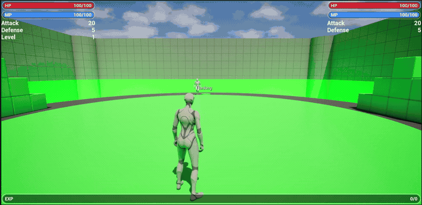

# RooGF RPG Game

An ongoing full RPG game project built with **Unreal Engine 5.7** and [RooGameplayFramework](https://www.fab.com/listings/12888893-e540-4785-a1a0-586931539fc7).

The project is being developed into a complete RPG game and will continue to grow over time. Its goal is to provide a cohesive, feature-rich gameplay foundation covering common RPG systems.

## Development Principles

Blueprints will be developed using consistent conventions and established best practices to ensure maintainability, extensibility, and strong runtime performance as the project grows.

## Current Showcase

### Stat Value Updates

## Chapter 1 Video Tutorial

Chapter 1 builds the project from the initial `v1.0.0` state into the data-driven Stats and combat foundation released in `v1.1.0`. The complete step-by-step tutorial covers RooGameplayFramework setup, the Stats Designer, Stats and Attributes, configurable damage Formulas, runtime value change events, and UI updates.

[Watch the complete Chapter 1 tutorial on YouTube](https://www.youtube.com/watch?v=LILH3-InaRI)

## Planned Features

- Character attributes and derived stats
- Buffs, debuffs, and status effects
- Levels, experience, and character progression
- Combat and enemy interactions
- Skills and abilities
- Equipment and equipment-based stat changes
- Shops and item trading
- Quests and objectives
- Items, consumables, and inventory interactions
- Additional common RPG gameplay systems

## Requirements

- Unreal Engine 5.7

## RooGameplayFramework

RooGameplayFramework is available on Fab:

[Visit the RooGameplayFramework Fab page](https://www.fab.com/listings/12888893-e540-4785-a1a0-586931539fc7)

## License

This project is licensed under the [MIT License](LICENSE).
